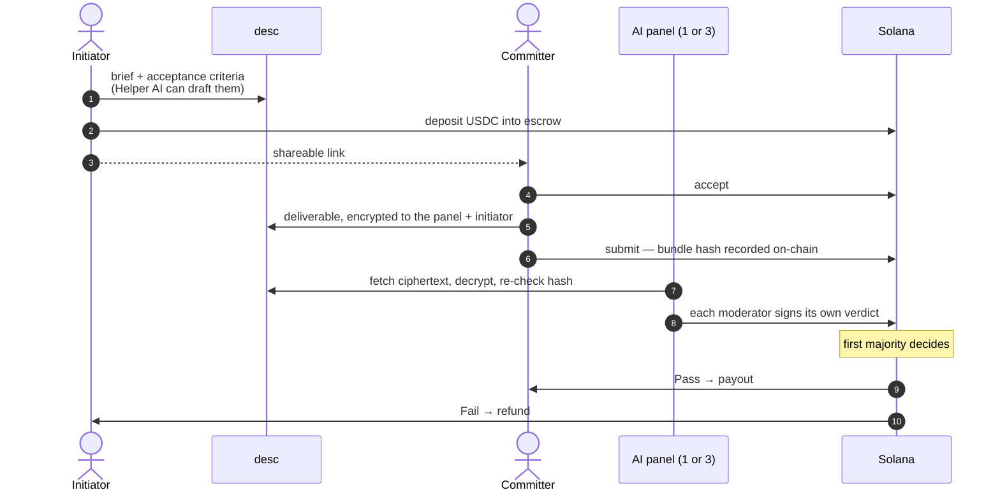
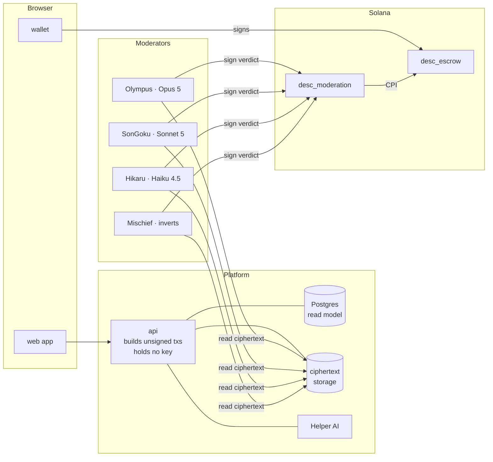
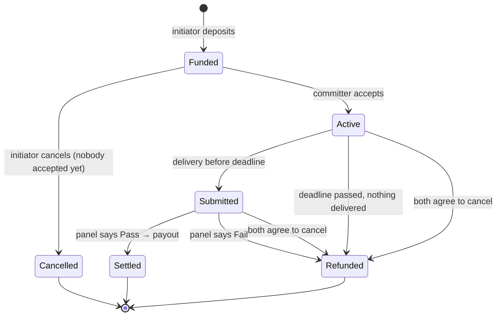

# desc

**Escrow for digital work on Solana, where a panel of AI moderators reads the
delivered files and votes on-chain before the money moves.**

> *"You already made the deal — now make it safe."*

Live on devnet → **[descprotocol.xyz](https://descprotocol.xyz)**

---

## The problem

Two strangers agree a bounty on Discord or Twitter, and someone has to go first.
The developer risks not being paid; the poster risks paying for nothing. When it
goes wrong there is no neutral party to decide who is right — and a human
arbitrator is slow, expensive, and has to be trusted.

desc is a **formalisation tool, not a marketplace**. People arrive having already
agreed the deal elsewhere. desc locks the money, defines what "done" means, and
lets independent AI judges decide whether it was delivered.

## How a deal works



1. **Initiator** writes a brief and acceptance criteria — or clicks **Suggest
   criteria** and the Helper AI drafts ones a moderator can actually check from
   the files.
2. They pick a **panel of 1 or 3 moderators**, each with its own on-chain price,
   and deposit the payout plus fees into an escrow. The committer receives a link.
3. **Committer** accepts, does the work, and uploads it. The browser bundles the
   files, computes a Merkle root, and encrypts the bundle to exactly that panel and
   the initiator — the server only ever stores ciphertext.
4. **Each moderator** decrypts the bundle, rebuilds it, confirms its hash matches
   the one on-chain, judges it against the criteria, and signs a verdict with its
   own wallet.
5. **The first majority decides.** Either party then executes the payout — so
   settlement never depends on desc being online.

## Why you can trust it

- **No central settlement key.** The backend holds no keypair at all — it only
  builds unsigned transactions for your wallet to sign. Verdicts reach the escrow
  by CPI from `desc_moderation`, signed by a registered moderator. Nobody at desc
  can move your money.
- **A panel, not one model.** Three moderators run different models (Claude Opus 5,
  Sonnet 5, Haiku 4.5). One wrong or failing moderator is outvoted.
- **The moderator is paid on any verdict**, pass or fail, so it has no reason to
  lean either way — including when it was outvoted.
- **The work is sealed.** Delivered files are encrypted to the contract's panel
  and initiator only. A moderator cannot read work it was not assigned.
- **On a Pass, the initiator gets the exact bytes that were judged**, re-verified
  against the on-chain hash before they are handed over.
- **Every moderator has an on-chain track record** — verdicts cast, and how often it
  agreed with the panel's majority — written by settlement itself, so it outlives
  the escrow and is nobody's database entry.

### The adversarial moderator

devnet runs a fourth moderator, **Mischief**, that judges for real and then submits
the **opposite** verdict. It exists to prove the panel works: put it on a panel of
three and it is outvoted, still paid for its work, and its record shows it. It is
refused on mainnet.

## Architecture



| Piece | Role |
|---|---|
| `desc_escrow` | Holds the USDC, runs the lifecycle, tallies the panel, pays everyone, records each moderator's reputation. 11 instructions. |
| `desc_moderation` | Registry of moderators — each an on-chain account with its own wallet, price and encryption key. The only path by which a verdict reaches an escrow. 5 instructions. |
| `apps/api` | Builds unsigned transactions, stores ciphertext blind, caches chain state for dashboards, runs the Helper AI. Cannot move funds. |
| `apps/web` | Create, accept, deliver, follow the verdict, pick moderators. |
| `mod-watch` | One process per moderator. Claims its seats, judges through Claude, signs its verdict. |
| `packages/shared` | Types, the bundle format (Merkle + denylist + size caps) and `age` encryption — used by browser, api and moderators alike. |

## Contract lifecycle



Once work is **submitted**, the funds are frozen until the panel rules or both
parties agree to cancel — the deadline no longer applies, so neither side can run
out the clock.

## Who gets paid

| Outcome | Committer | Initiator | Moderators | Protocol |
|---|---|---|---|---|
| **Pass** | the payout | unused moderator fees | each voter its own price | fee |
| **Fail** | — | payout + most of the fee | each voter its own price | verification fee only |
| Nobody delivered | — | everything | — | — |
| Cancelled before acceptance | — | everything | — | — |

Protocol fee is 2% with a floor; each moderator sets its own price on its on-chain
account (0.5%–1% today, capped at 5%). A moderator that never voted is not paid,
and its fee goes back to the initiator.

There is also a **no-mod** mode: the initiator can skip verification entirely,
accepting the risk, for deals where speed matters more than proof.

## Live on devnet

| | |
|---|---|
| Site | [descprotocol.xyz](https://descprotocol.xyz) |
| `desc_escrow` | [`4Q1jTgR9UVpbbVo57Dx1cpjo77Hx8oBn78ieex4gY2CU`](https://explorer.solana.com/address/4Q1jTgR9UVpbbVo57Dx1cpjo77Hx8oBn78ieex4gY2CU?cluster=devnet) |
| `desc_moderation` | [`AHGBmnYQCXJwnKKPixjmt6KAbDjVpMQtETRASzycJ47T`](https://explorer.solana.com/address/AHGBmnYQCXJwnKKPixjmt6KAbDjVpMQtETRASzycJ47T?cluster=devnet) |
| Settlement token | Circle's devnet USDC, `4zMMC9srt5Ri5X14GAgXhaHii3GnPAEERYPJgZJDncDU` |

One contract, end to end:

| Step | Transaction |
|---|---|
| Committer submits | [`4svmX3bm…aNS`](https://explorer.solana.com/tx/4svmX3bmdGSR1wm4rfGLKhnyty44nMK1WGfXRSoSkeadTmDjLM8QNLZRpZnWTaegwwomG5tfhdodw6eYSr5cuaNS?cluster=devnet) |
| A moderator signs its verdict → CPI into the escrow | [`48ex5EiQ…jqBn`](https://explorer.solana.com/tx/48ex5EiQ6GGckMbn9tkdSPpQmbu9T2dFYp78nsrLKSLWas56eJjnkMzd58fxfyUQrwGKQxsVyvwa3KawH867jqBn?cluster=devnet) |
| Funds released | [`4ZLkNckY…ads8`](https://explorer.solana.com/tx/4ZLkNckYuerWaGegHoBD6Q6oj5ejuwQJBwaXKVfNG7nwiQxB8KweSYD9C2mnXHYzkUxKAopLD4CaUXJD8DqGads8?cluster=devnet) |

## Repository

```
programs/
  desc_escrow/          escrow, panel, settlement, moderator reputation (Anchor)
  desc_moderation/      moderator registry; verdicts reach the escrow by CPI
platform/
  apps/api/             backend, Helper AI, moderator runners, scripts
  apps/web/             the product
  apps/admin/           read-only oversight console
  packages/shared/      types, bundle format, encryption
feature-doc.md          status, design decisions and roadmap
```

**Tested:** 87 on-chain tests across 16 files, plus 10 end-to-end flows that drive
the full lifecycle — create, accept, deliver, judge, settle — through the real api
against a real validator, with no human in the loop.

**Run it locally:** see [`platform/README.md`](platform/README.md).

## Status

| | |
|---|---|
| Escrow, panels of 1 or 3, majority settlement | ✅ |
| AI moderators on Claude, four live on devnet | ✅ |
| Encrypted delivery, verified hand-over on Pass | ✅ |
| On-chain moderator reputation | ✅ |
| Helper AI for acceptance criteria | ✅ |
| No-mod mode | ✅ |
| Commit–reveal voting, verdict deadline, tiebreakers | next |
| Open moderator registration, staking and slashing | V2 |
| Client SDK for other applications | V2 |

Design decisions, trade-offs and the full roadmap live in
[`feature-doc.md`](feature-doc.md).
