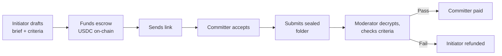
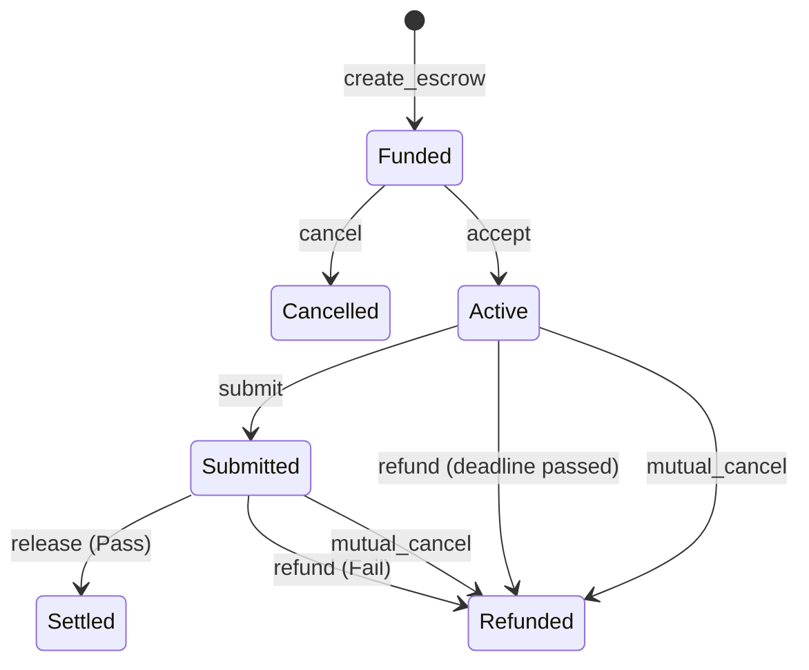
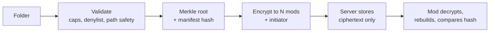
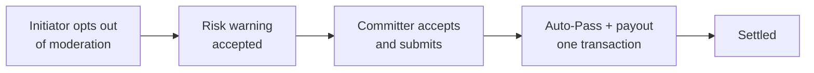
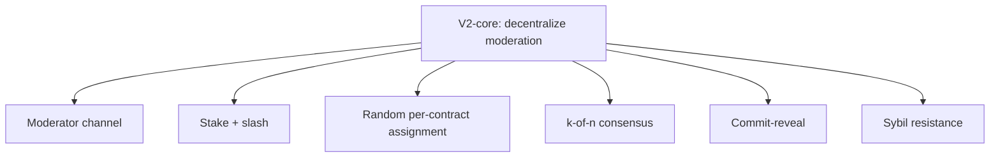

# desc — status & roadmap

*Last updated: 2026-08-28*

Legend: ✅ built · 🔨 in progress · ⬜ not started · 🔮 later version · 🚫 set aside

---

## 1. What desc is

- A **formalization tool, not a marketplace.** Two people who already agreed on a
  deal elsewhere come here to make it safe.
- No listings, no discovery, no matching. Entry point is *"I have a deal."*
- **Wedge:** Solana bounty-style dev work with checkable deliverables.
- **Pitch:** *"You already made the deal — now make it safe."*
- Onboarding is a **shareable link** — no signup for the committer.
- The moat is **verification quality**, not network effects.
- **"Made a deal"** means agreed on deliverable + price, *without* mutual trust.
  That is precisely the buyer — the positioning holds.

This identity holds through V1, V2 and V3.

---

## 2. How it works

The moderator is an **automated service**, not a person in a UI. There is no
moderator interface, and the admin console is read-only oversight.

### On-chain lifecycle

Once **Submitted**, funds are frozen until a verdict. The deadline no longer
applies. The off-chain status mirrors these six 1:1 — there is no `draft` or
`disputed` state.

### Deliverable pipeline

The chain stores only `sha256(manifest)`. The server never sees plaintext. A mod
that can't reproduce the hash refuses to judge.

---

## 3. Money

Settled in **USDC**. SOL is only transaction fees and refundable rent.

| Parameter | Value | Where it lives |
|---|---|---|
| Protocol fee | `max(2%, $1)` | on-chain `Config` |
| Moderator fee | 1% | server-side rule |
| Smallest contract | $50 | on-chain `Config` |
| Verification fee | $1 (= the floor) | snapshotted per escrow |

### Who gets paid, by outcome

| Outcome | Protocol | Moderator | Initiator |
|---|---|---|---|
| **Pass** | full fee | 1% | — (committer paid in full) |
| **Fail** | $1 only | 1% | everything else back |
| **Ghost timeout** | nothing | nothing | everything back |
| **Cancel / mutual cancel** | nothing | nothing | everything back |

Two principles behind this:

- The protocol is paid for **running the check**, not for the answer. So it never
  profits from a failed deal, and is never paid to pass one.
- The floor exists because cost-to-serve is roughly fixed per contract while a
  percentage is not. $50 is where 2% meets the $1 floor.

---

## 4. Status at a glance

| Piece | State |
|---|---|
| `desc_escrow` program (10 instructions) | ✅ |
| `desc_moderation` program (4 instructions) | ✅ |
| Deliverable pipeline (seal → encrypt → verify) | ✅ |
| API + Postgres read model | ✅ |
| Web app | ✅ |
| Admin console (read-only) | ✅ |
| Fee model (floor, verification fee, minimum) | ✅ |
| No-mod mode | ✅ |
| Moderator runner (`mod-run`) | ✅ with a **manual** verdict |
| **AI moderator** | ⬜ |
| **Helper AI** | ⬜ |
| Background reconciler | ⬜ |
| Verdict consensus (k-of-n) | 🔮 V2 |

---

## 5. What's built

**On-chain**

- `desc_escrow` — full money lifecycle. Fee snapshotted at creation so a config
  change can't alter a live deal. Both accounts carry `reserved` padding so new
  fields never need a `realloc`.
- `desc_moderation` — mods are on-chain PDAs with their own wallets. They sign
  verdicts and CPI into the escrow. **There is no central settlement keypair.**

**Off-chain**

- API holds **no signing key** — it builds unsigned transactions, the user signs,
  the API submits.
- Deliverables are sealed to every active mod **and the initiator**, so a Pass
  hands over exactly the bytes that were verified.
- Read model caches chain state in Postgres, and the list view re-reads the chain
  in one batched call.

**The verification seam**

`runCheck(criteria, files) → { outcome, reasoning }` is the swap point. Today it
returns an operator's manual decision. The real AI drops in here without touching
the runner, the API, or the chain.

---

## 6. What's left for MVP

In order.

| # | Item | Why |
|---|---|---|
| 1 | **Thin AI moderator slice** — one model call: criteria + files → pass/fail + reasoning | Tests the whole thesis. Everything else is chassis. |
| 2 | **Helper AI** — brief → checkable criteria | Vague criteria cause failed verification and disputes. Highest-leverage V1 work. |
| 3 | **Constrain criteria to bundle-checkable claims** | A mod sees a folder. It cannot see "merged" or "deployed". |
| 4 | **Fix the deadline bug** — form accepts today's date, tx then fails | User signs, then loses a transaction fee. |
| 5 | **Honest copy** — site says "AI moderator" and there isn't one yet | Decide: build it, or change the words. |
| 6 | **Background reconciler** | Users can go direct to chain and bypass the API; the cached list then goes stale. |
| 7 | **Crypto unit tests** — Merkle, denylist, `age` round-trip | Silent bugs there are security bugs. |
| 8 | **Break-even model** | Confirms whether $1 / $50 are the right numbers. |
| 9 | **10 willingness-to-pay conversations** with people scammed on a Solana bounty | Do this before expanding scope, not after. |

Not blocking, but do before launch: revive the `e2e/` scripts (they use a removed
deliverable type and a deleted admin route), and drop the vestigial `moderators`
table and its unused repo.

The validator covers path traversal, control characters, denylists, and per-file
plus total size caps. What it lacks is tests — see #7.

---

## 7. No-mod mode

An escrow the initiator chooses to run **without verification**. Lets deals close
cheaply, and becomes the upsell on-ramp to moderation.

**Rules**

- Initiator opts out at creation, behind a warning modal. The initiator carries
  all the risk.
- **No moderator fee** — nobody earned one.
- **No verification fee** either — no check ran, so there is nothing to recover.
  Protocol fee only.
- Submission auto-passes **and settles in the same transaction** — one signature,
  no "click release" step for a verdict that was never in doubt.
- **The mode is visible to both parties** — the committer can see there is no
  moderator. Only the initiator gets the warning; they chose it and carry the risk.
- The deliverable is sealed to the **initiator alone** — no moderator will ever
  open it, so none receives a copy. The initiator's key is therefore mandatory.

**The trade-off, stated plainly:** this protects the committer completely (paid
on submission) and exposes the initiator completely (may pay for junk). That is
the right asymmetry for the bounty wedge, where the committer's fear is
non-payment. Market it as what it is — *the initiator trusts you* — not as a
cheaper version of a moderated deal.

**How it's built**

| Layer | |
|---|---|
| Program | `no_mod` on the escrow, carved from `reserved`. `submit` records the Pass itself. `release`'s moderator account is optional. Creation rejects a no-mod escrow that still pays a moderator, and a moderated one with no moderators. |
| API | `noMod` on the create request; surcharge, count and verification fee all forced to 0 server-side. The submit transaction carries `submit` + `release` together, so it lands on `settled`. |
| Web | Opt-out checkbox with a risk warning, fee panel drops the moderator row, and the contract page shows an amber banner to **both** parties. |

The auto-pass is on-chain, not a backend job. The payout rides in the same
transaction, so it's atomic: if the money can't move, the submission doesn't
happen either.

---

## 8. Open questions

- **Fee floor vs. break-even** — $1 is a guess until the model is written.
- **Dispute handling** — manual review at V1 with a 48-business-hour target. No
  on-chain dispute state and no timelock; a recorded verdict is immediately
  executable.

---

## 9. After MVP

### V1.5 — cheap, high trust-signal

- ⬜ **Reputation** — on-chain completed-deal counts for both parties. Low
  complexity, directly attacks cold-start trust, feeds mod weighting later.

### V2 — decentralize moderation *(this is the real differentiator)*

**Watch the incentive:** paying on any verdict removes pass-bias, but once mods
are external and staked, *"fail everything for a guaranteed fee at near-zero
compute"* becomes viable. Slashing has to target false-**Fail**, not only
false-Pass.

**Moderator channel — needed before the first external mod.** Today `mod-run`
queries the database directly, so a third-party moderator would need our DB
credentials. It has to become a small public API:

- `GET /moderation/queue` → **only the contracts assigned to the calling mod**;
  escrow address, criteria, deliverable hash
- `GET /moderation/:id/bundle` → the ciphertext, still sealed to that mod's key

The queue is scoped per moderator, not global: once assignment is random a mod
is on some contracts and not others, and handing it work it was not picked for
would let it judge anything it liked. Scoping is what makes assignment mean
something.

The mod decrypts locally, judges, and signs `submit_verdict` itself — the
platform sees no plaintext and no verdict, so it stays a queue and a blob store.
Auth is a wallet signature checked against `moderatorPda`; no API keys. `mod-run`
becomes a client of it, which is also the test: if our own moderator needs
nothing private, nobody's does.

Everything below is expansion, not core — do it after the above:

- 🔮 Human juror escalation tier (required before subjective work)
- 🔮 Third-party moderator market
- 🔮 Task decomposition — parent/child escrows, one committer per sub-task
- 🔮 SDK / API for Superteam Earn, Layer3, Questbook, Dework
- 🔮 Embedded wallets + fiat ramps (opens the Web2 market)
- 🔮 Niche expansion: one-off dev contracts, then campaign/marketing work

**Settled:** stake in **USDC**, not a token. A token adds speculation and
securities surface and solves nothing USDC can't.

### V3 — attested verdicts

- 🔮 TEE remote attestation first; zkML is years out and very expensive.
- **Honest limit:** a TEE proves *some* code ran in an enclave — not that a *good*
  model made a *good* judgment. Realistically V3 is an attested *pipeline*.
- **Therefore:** rank V2-core above V3. The economics deliver most of the honesty
  guarantee at far lower complexity. V3 is a credibility capstone.

### V4+ — set aside

🚫 Marketplace / discovery · 🚫 yield on escrowed funds (a venue hack kills a trust
product) · 🚫 native token

---

## 10. Monetization

Keep the consumer % low — it's the adoption lever. Make margin elsewhere.

| Rank | Stream | Why |
|---|---|---|
| 1 | **Team / grants subscriptions** | A DAO grants desk pays monthly for volume, analytics, priority SLA. Best near-term margin. |
| 2 | **SDK licensing** | High-margin B2B that never touches the consumer fee. |
| 3 | **Premium Helper AI** | Better criteria *reduce your dispute cost*. Incentive-aligned. |
| 4 | **Mod-marketplace take-rate** (V2) | Scales with the network, not the base fee. |
| 5 | Priority dispute review | Subsidises the labour cost directly. |
| 6 | Fiat ramp spread (V2) | Standard fintech revenue. |

Goal: drop the consumer fee toward ~1% and monetize the platform instead.

---

## 11. Decisions log

Settled — don't relitigate without a reason.

| Decision | Detail |
|---|---|
| Moderator is paid on **any** verdict | Pass *or* Fail. Paying only on Pass creates pass-bias. |
| Protocol keeps only the verification fee on a Fail | Never profits from failure, never paid to pass. |
| No settlement keypair | Mods sign with their own wallets via `desc_moderation`. |
| Deliverable types are bundle-checkable | `mergeable`, `deployable`, `tests_pass`, `spec_met` — not "merged"/"deployed". |
| Initiator is an encryption recipient | A Pass delivers the verified bytes, not a side-channel promise. |
| Single mod verdict at V1 | Consensus is V2. |
| No moderator selection at V1 | Random assignment is V2. Initiators never pick, ever. |
| Deliverable types: one per contract | Multiple types is an off-chain change, deferred. |
| AI comes last | Build every seam first, drop the model in at `runCheck`. |
| No "trustless" language at V1 | The platform runs every mod. Decentralization is a V2 promise. |
| USDC only | No native token before V4, if ever. |

### The honest V1 trust model

V1 is **"trust desc."** The platform runs the mods and holds their keys. The
no-settlement-keypair design is real but ceremonial at this scale.

`trust (V1) → stake & slash (V2) → proof (V3)`

Say that plainly in external copy.
