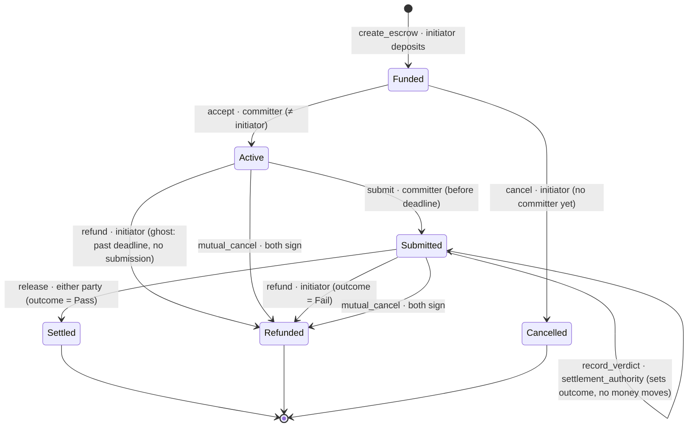

# Escrow lifecycle

The on-chain state machine for `desc_escrow`. The chain tracks only what moves
money; richer off-chain states (draft, under_verification, disputed) live in the
backend.

## State diagram



## ASCII view

```
                       create_escrow (initiator deposits amount+fee+surcharge)
                                       │
                                       ▼
        cancel (initiator,         ┌────────┐
        no committer) ◄────────────│ Funded │
                │                  └────────┘
                ▼                       │ accept (committer ≠ initiator)
          ┌───────────┐                 ▼
          │ Cancelled │           ┌────────┐   refund: ghost
          └───────────┘           │ Active │──(past deadline,──┐
                                  └────────┘   no submission)  │
                                       │ submit (≤ deadline)   │
                                       ▼                       │
                              ┌───────────────┐  mutual_cancel │
                              │   Submitted   │──(both sign)───┤
                              └───────────────┘                │
                          record_verdict │ (authority sets     │
                          outcome=Pass/Fail; no money moves)   │
                       ┌───────────────┴───────────────┐       │
              release  │ (outcome=Pass)     refund      │(Fail) │
           either party▼                    initiator   ▼       ▼
                  ┌─────────┐                      ┌──────────┐
                  │ Settled │                      │ Refunded │
                  └─────────┘                      └──────────┘
```

## Instruction reference

| Instruction | Signer(s) | From → To | Guard | Money |
|---|---|---|---|---|
| `create_escrow` | initiator | — → **Funded** | not paused, amount>0, deadline>now | deposit `amount+fee+surcharge` → vault |
| `cancel` | initiator | Funded → **Cancelled** | committer is None | full vault → initiator; close vault |
| `accept` | committer | Funded → **Active** | committer ≠ initiator; first-accept-wins | — |
| `submit` | committer | Active → **Submitted** | is bound committer; now ≤ deadline | — (records deliverable hash) |
| `record_verdict` | settlement_authority | Submitted → Submitted | one-shot (outcome was None) | — (attestation only) |
| `release` | initiator **or** committer | Submitted → **Settled** | outcome = Pass | `amount`→committer, `fee+surcharge`→treasury; close vault |
| `refund` | initiator | Active/Submitted → **Refunded** | ghost (past deadline, no submit) **or** outcome = Fail | full vault → initiator; close vault |
| `mutual_cancel` | initiator **+** committer | Active/Submitted → **Refunded** | both sign | full vault → initiator; close vault |

## Key invariants

- **No unilateral cancel once `Active`.** Once a committer is bound, the initiator
  can only get funds back via the ghost timeout, a `Fail` verdict, or mutual cancel.
- **Freeze on submit.** Once `Submitted`, the deadline is irrelevant — only a
  recorded verdict (or mutual cancel) can move the money.
- **Attestation ≠ execution.** `record_verdict` only sets the outcome; *either
  party* then executes `release`/`refund`, so payout never depends on the
  settlement authority being online (liveness).
- **Deadline governs ghosting only** — the gap between `accept` and `submit`.

## On-chain vs off-chain

`record_verdict` is the seam to the verdict system. In V1 the `settlement_authority`
is the platform backend (aggregating federated moderators off-chain). In V2 it
becomes a `desc_moderation` program PDA that attests after on-chain consensus —
the escrow program is unchanged.
