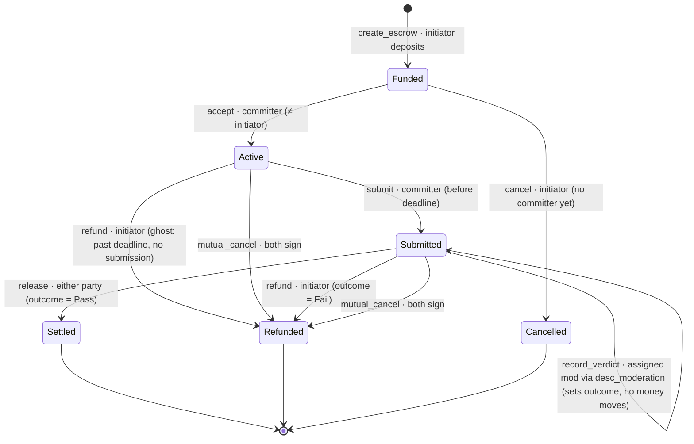

# Escrow lifecycle

The on-chain state machine for `desc_escrow`. The chain tracks only what moves
money; richer off-chain states (draft, under_verification, disputed) live in the
backend.

## State diagram



## ASCII view

```
                       create_escrow (initiator deposits amount+fee+surcharge)
                                       │
                                       ▼
        cancel (initiator,         ┌────────┐
        no committer) ◄────────────│ Funded │
                │                  └────────┘
                ▼                       │ accept (committer ≠ initiator)
          ┌───────────┐                 ▼
          │ Cancelled │           ┌────────┐   refund: ghost
          └───────────┘           │ Active │──(past deadline,──┐
                                  └────────┘   no submission)  │
                                       │ submit (≤ deadline)   │
                                       ▼                       │
                              ┌───────────────┐  mutual_cancel │
                              │   Submitted   │──(both sign)───┤
                              └───────────────┘                │
                          record_verdict │ (authority sets     │
                          outcome=Pass/Fail; no money moves)   │
                       ┌───────────────┴───────────────┐       │
              release  │ (outcome=Pass)     refund      │(Fail) │
           either party▼                    initiator   ▼       ▼
                  ┌─────────┐                      ┌──────────┐
                  │ Settled │                      │ Refunded │
                  └─────────┘                      └──────────┘
```

## Instruction reference

| Instruction | Signer(s) | From → To | Guard | Money |
|---|---|---|---|---|
| `create_escrow` | initiator | — → **Funded** | not paused, `amount ≥ min_amount`, deadline>now; moderator registered + active; its price ≤ `max_moderator_fee` | deposit `amount+fee+surcharge` → vault. Fee from `Config`, surcharge from the **moderator's own account** — neither is an argument |
| `cancel` | initiator | Funded → **Cancelled** | committer is None | full vault → initiator; close vault |
| `accept` | committer | Funded → **Active** | committer ≠ initiator; first-accept-wins | — |
| `submit` | committer | Active → **Submitted** | is bound committer; now ≤ deadline | — (records deliverable hash) |
| `record_verdict` | settlement_authority (`desc_moderation` verdict PDA) | Submitted → Submitted | one-shot; must be the moderator **assigned at creation** | — (attestation only) |
| `release` | initiator **or** committer | Submitted → **Settled** | outcome = Pass | `amount`→committer, `fee`→treasury, `surcharge`→moderator; close vault |
| `refund` | initiator | Active/Submitted → **Refunded** | ghost (past deadline, no submit) **or** outcome = Fail | **ghost:** full vault → initiator. **Fail:** `surcharge`→moderator, `verification_fee`→treasury, rest→initiator; close vault |
| `mutual_cancel` | initiator **+** committer | Active/Submitted → **Refunded** | both sign | full vault → initiator; close vault |

## Key invariants

- **No unilateral cancel once `Active`.** Once a committer is bound, the initiator
  can only get funds back via the ghost timeout, a `Fail` verdict, or mutual cancel.
- **Freeze on submit.** Once `Submitted`, the deadline is irrelevant — only a
  recorded verdict (or mutual cancel) can move the money.
- **Attestation ≠ execution.** `record_verdict` only sets the outcome; *either
  party* then executes `release`/`refund`, so payout never depends on the
  settlement authority being online (liveness).
- **Deadline governs ghosting only** — the gap between `accept` and `submit`.

## On-chain vs off-chain

`record_verdict` is the seam to the verdict system. `settlement_authority` is the
`desc_moderation` verdict PDA (`bootstrap` sets it), so only a registered moderator
settles, by CPI — no platform keypair can.

## Who sets the money

- **Protocol fee** — derived from `Config` at creation.
- **Moderator surcharge** — the chosen moderator's own price, read from its
  `Moderator` account at creation. Escrow cannot import that type (the
  moderation program depends on escrow), so it reads the account raw and trusts
  it only if the moderator's verdict PDA equals this escrow's
  `settlement_authority`.
- **`max_moderator_fee`** — the initiator's limit, not the fee. A price above it
  fails creation; a limit of 0 fails instead of creating an unpaid escrow.
- All three are snapshotted on the escrow, so later changes don't touch it.
