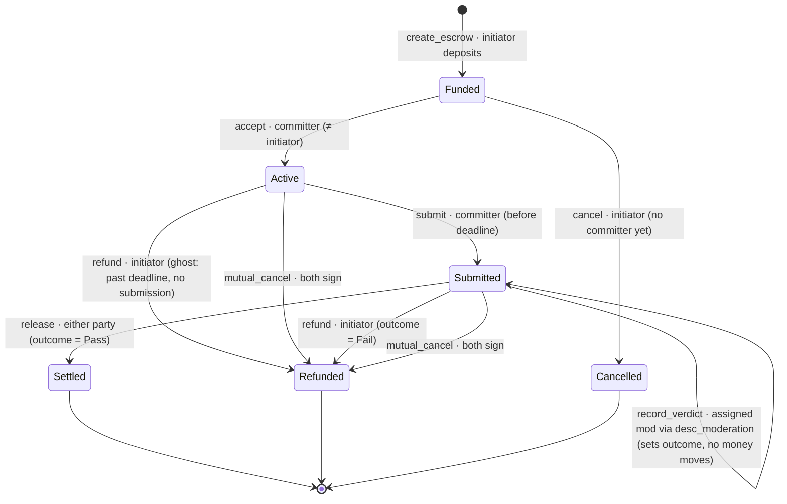

# Escrow lifecycle

The on-chain state machine for `desc_escrow`. The chain tracks only what moves
money; richer off-chain states (draft, under_verification, disputed) live in the
backend.

## State diagram



## ASCII view

```
                       create_escrow (initiator deposits amount+fee+surcharge)
                                       │
                                       ▼
        cancel (initiator,         ┌────────┐
        no committer) ◄────────────│ Funded │
                │                  └────────┘
                ▼                       │ accept (committer ≠ initiator)
          ┌───────────┐                 ▼
          │ Cancelled │           ┌────────┐   refund: ghost
          └───────────┘           │ Active │──(past deadline,──┐
                                  └────────┘   no submission)  │
                                       │ submit (≤ deadline)   │
                                       ▼                       │
                              ┌───────────────┐  mutual_cancel │
                              │   Submitted   │──(both sign)───┤
                              └───────────────┘                │
                          record_verdict │ (authority sets     │
                          outcome=Pass/Fail; no money moves)   │
                       ┌───────────────┴───────────────┐       │
              release  │ (outcome=Pass)     refund      │(Fail) │
           either party▼                    initiator   ▼       ▼
                  ┌─────────┐                      ┌──────────┐
                  │ Settled │                      │ Refunded │
                  └─────────┘                      └──────────┘
```

## Instruction reference

| Instruction | Signer(s) | From → To | Guard | Money |
|---|---|---|---|---|
| `create_escrow` | initiator | — → **Funded** | not paused, `amount ≥ min_amount`, deadline>now; **0, 1 or 3** moderators, each registered + active and none twice; their prices sum ≤ `max_moderator_fee` | deposit `amount+fee+Σ prices` → vault, and open the **`Panel`** (rent from the initiator). Fee from `Config`, each price from the **moderator's own account** — neither is an argument |
| `cancel` | initiator | Funded → **Cancelled** | committer is None | full vault → initiator; close vault **and panel** (both rents → initiator) |
| `accept` | committer | Funded → **Active** | committer ≠ initiator; first-accept-wins | — |
| `submit` | committer | Active → **Submitted** | is bound committer; now ≤ deadline | — (records deliverable hash) |
| `record_verdict` | settlement_authority (`desc_moderation` verdict PDA) | Submitted → Submitted | must hold a **seat on the panel**; one vote per seat | — (attestation only). Records the vote; the **first side to reach quorum** sets the outcome and is final. A later vote is still recorded and still paid, but cannot move it |
| `release` | initiator **or** committer | Submitted → **Settled** | outcome = Pass | `amount`→committer, `fee`→treasury, **each voting moderator its own fee** (token accounts as remaining accounts, in panel order), unspent fees of moderators that never voted → initiator; close vault **and panel** (rents → initiator) |
| `refund` | initiator | Active/Submitted → **Refunded** | ghost (past deadline, no submit) **or** outcome = Fail | **ghost:** full vault → initiator. **Fail:** each voting moderator its own fee, `verification_fee`→treasury, rest→initiator; close vault **and panel** (rents → initiator) |
| `mutual_cancel` | initiator **+** committer | Active/Submitted → **Refunded** | both sign | full vault → initiator; close vault. **Does not close the panel and pays no voter** — open issue |

## Key invariants

- **No unilateral cancel once `Active`.** Once a committer is bound, the initiator
  can only get funds back via the ghost timeout, a `Fail` verdict, or mutual cancel.
- **Freeze on submit.** Once `Submitted`, the deadline is irrelevant — only a
  recorded verdict (or mutual cancel) can move the money.
- **Attestation ≠ execution.** `record_verdict` only sets the outcome; *either
  party* then executes `release`/`refund`, so payout never depends on the
  settlement authority being online (liveness).
- **Odd panels only.** 0, 1 or 3 seats. An even panel can split with no majority
  and would leave the escrow unsettleable, so `create_escrow` rejects it.
- **Fees are summed, never split.** Every moderator runs the whole check, so each
  is paid a full fee and the initiator deposits `n ×` the rate. Splitting one fee
  would pay the third moderator a third as much for identical work.
- **Paid for judging, not for agreeing.** A moderator that was outvoted, or whose
  vote landed after the majority, is paid exactly like the rest — otherwise the
  incentive is to vote with the crowd rather than with the deliverable.
- **The panel is the record of who may vote.** `Escrow::moderator` is only set on
  a one-moderator contract and is `Pubkey::default()` on a panel of three; read
  the `Panel`.
- **The panel does not outlive settlement.** It is closed on `release`/`refund`
  (and `cancel`) to return its rent, so the per-moderator votes are gone from
  chain afterwards. The escrow keeps the outcome and the deciding verdict hash;
  each vote also remains as that moderator's own signed transaction.
- **Deadline governs ghosting only** — the gap between `accept` and `submit`.

## On-chain vs off-chain

`record_verdict` is the seam to the verdict system. `settlement_authority` is the
`desc_moderation` verdict PDA (`bootstrap` sets it), so only a registered moderator
settles, by CPI — no platform keypair can.

## Who sets the money

- **Protocol fee** — derived from `Config` at creation.
- **Moderator surcharge** — the chosen moderator's own price, read from its
  `Moderator` account at creation. Escrow cannot import that type (the
  moderation program depends on escrow), so it reads the account raw and trusts
  it only if the moderator's verdict PDA equals this escrow's
  `settlement_authority`.
- **`max_moderator_fee`** — the initiator's limit, not the fee. A price above it
  fails creation; a limit of 0 fails instead of creating an unpaid escrow.
- All three are snapshotted on the escrow, so later changes don't touch it.
